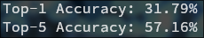
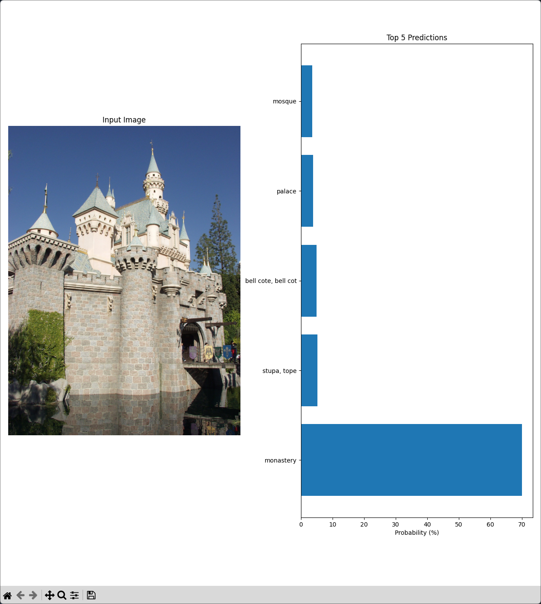
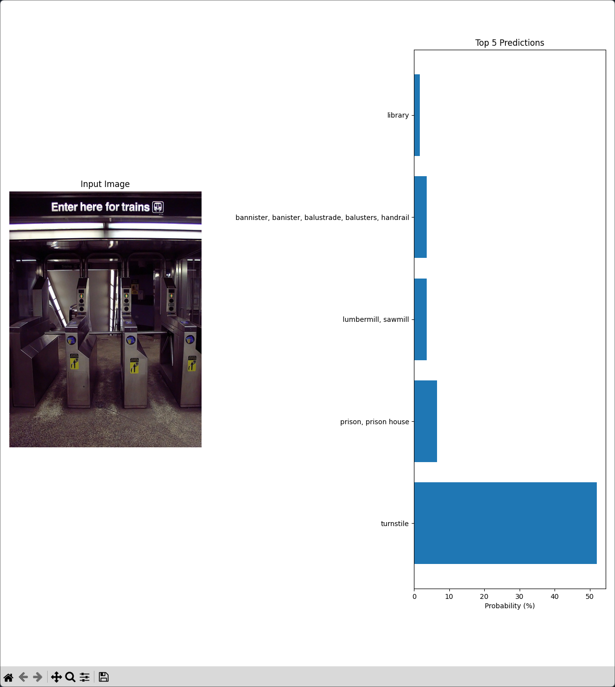

# AlexNet Implementation
## Learnings
### Implementation
Had to use HuggingFace's API to get access to imagenet-1k. The original website was broken. 
### Paper Review
Basically, this paper showed that deep learning could be applied to image classification tasks. Prior to this paper, researchers had to manually use hand-crafted features, like Scale-Invariant Feature Transform and Histogram of Oriented Gradients. 

The model contains 8 layers with weights. The first 5 are convolutional layers. Response-normalization (modern practice is to use BatchNorm) follows first 2 layers (modern practice is to follow after every layer). Max pooling layers, essentially a method for summarize the output of neighbouring pixels, follow layer 1,2 and 5. ReLU is applied to every convolutional layer and fully connected layer. 

### Self Reflection
Creating a model is honestly pretty easy. To be fair, I did have Claude Sonnet 3.5 help me for 75% of the project, but I think I get some leniency given that this is my first attempt at implementing a paper. 

Hardest part was dealing with git and large files...

There are 4 main stages to implementing a research paper's model:
1. Get data (Data augmentation, data preprocessing) (50% of time spent)
2. Create the model architecture                    (10% of time spent)
3. Write code to allow training for a single epoch  (30% of time spent) (Accounting for actual training time)
4. Evaluation and inference                         (10% of time spent)

Getting the data is simple with HuggingFace's API, however it does take up ~130GB. 

## Results
I only trained for 2 epochs, because I don't want to kill my GPU. Here are the results after running evaluation:

Here are some images and the model's corresponding top 5 predictions:

## Notes
- Model weights cannot be saved on repo (boo microsoft). Gonna have to upload them to Google Drive or something (Spent 5 hours trying to untrack the weights from git)
- Researchers used 90 epochs to train the model...

